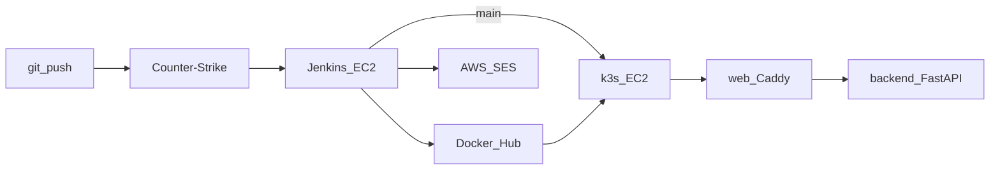

# Architektura

## Przegląd

## Komponenty aplikacji

| Komponent | Technologia | Port | Rola |
|-----------|-------------|------|------|
| backend | FastAPI + Socket.IO, Python 3.12 | 8000 | Symulacja gry, API, WebSocket |
| web | Caddy + zbudowany klient Vite/Three.js | 80 | Static UI, reverse proxy `/api` i `/socket.io` |

Na k3s oba działają w namespace `webstrike`. Service `backend` jest ClusterIP (nazwa DNS `backend` — tak jak w Caddyfile). Service `web` jest NodePort **30080**.

## Infrastruktura AWS

| Zasób | Typ | Uwagi |
|-------|-----|-------|
| Jenkins | t3.small EC2 | CI/CD, Docker, kubectl |
| k3s | t3.small EC2 | klaster + aplikacja + monitoring lite |
| S3 | bucket | Terraform state |
| SES | e-mail | powiadomienia z pipeline |

## CI/CD

1. Push na dowolną gałąź → testy (pytest, typecheck/build) → obrazy Docker → Docker Hub → e-mail  
2. Push na `main` → dodatkowo `kubectl apply` + `set image` + rollout  

## Monitoring

Namespace `monitoring`: Prometheus, Grafana (30300), Loki, Alertmanager, Promtail (logi podów `webstrike`).
