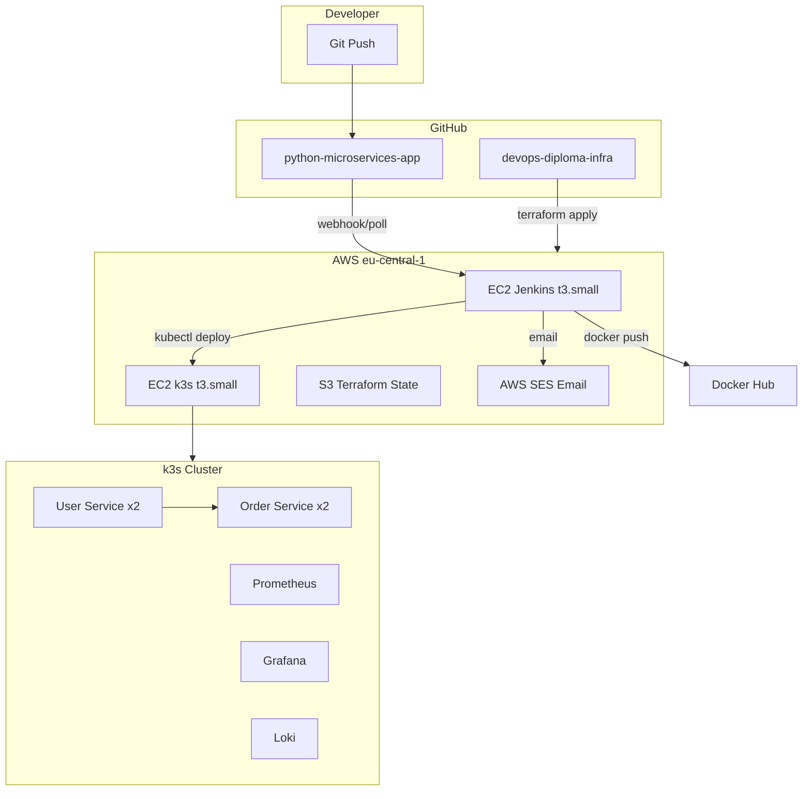

# Architektura projektu DevOps

## Przegląd

Projekt dyplomowy demonstruje pełny cykl DevOps: IaC, CI/CD, konteneryzację, orkiestrację Kubernetes i monitoring.

## Komponenty

### Aplikacja (Repo 1)

| Serwis | Technologia | Port | Rola |
|--------|-------------|------|------|
| User Service | FastAPI | 8001 | Zarządzanie użytkownikami |
| Order Service | Flask | 8002 | Zamówienia, integracja z User Service |

### Infrastruktura (Repo 2)

| Warstwa | Narzędzie | Opis |
|---------|-----------|------|
| IaC | Terraform | VPC, SG, 2× EC2, S3 state |
| Konfiguracja | Ansible | Jenkins, k3s, ufw, Helm |
| Orkiestracja | k3s | Kubernetes single-node |
| CI/CD | Jenkins | Build, test, push, deploy |
| Rejestr | Docker Hub | Obrazy kontenerów |
| Monitoring | Prometheus + Grafana | Metryki i alerty |
| Logi | Loki + Promtail | Centralne logowanie |
| Powiadomienia | AWS SES | E-mail o wyniku pipeline |

## Przepływ CI/CD

1. **Push na dowolną gałąź** → Jenkins CI: test → build → push Docker Hub → e-mail
2. **Push na `main`** → Jenkins CD: build → push → deploy k3s → weryfikacja → e-mail

## Bezpieczeństwo

- SSH (22), Jenkins (8080), k3s API (6443): tylko IP administratora
- HTTP/HTTPS (80/443): publiczny dostęp do aplikacji demo
- Sekrety w Jenkins Credentials, nie w repozytorium
- UFW na obu serwerach EC2
- S3 state bucket: szyfrowanie AES256, brak dostępu publicznego

## Koszty AWS

| Zasób | Szacunek/mies. |
|-------|----------------|
| 2× EC2 t3.small | ~30 USD |
| 2× EBS gp3 | ~4 USD |
| 2× EIP (attached) | 0 USD |
| S3 state | ~0.02 USD |
| SES | ~0 USD (sandbox) |
| **Razem** | **~35 USD/mies.** |
